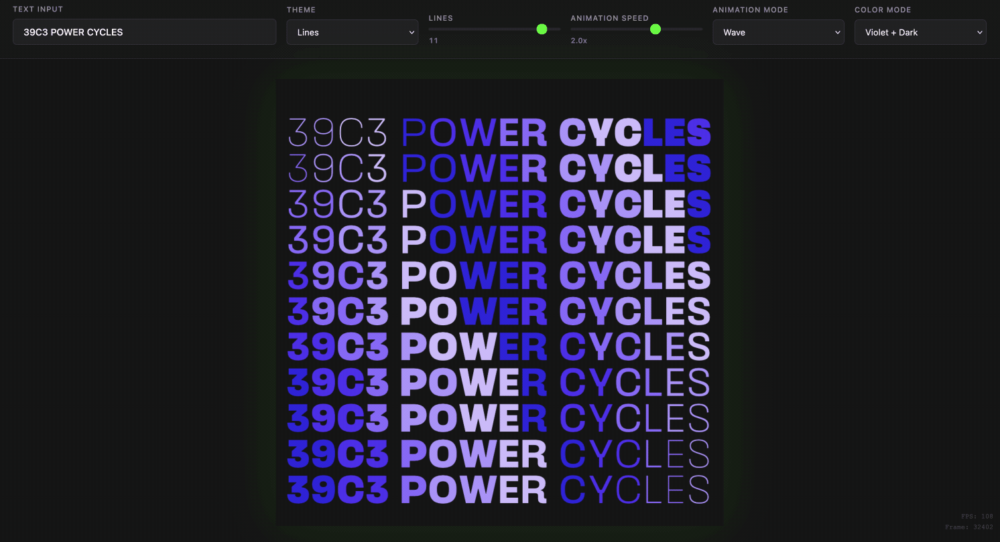

# 39C3 Power Cycles – Artwork Generator


Interactive web-based artwork generator for the 39C3 variable font, featuring dynamic weight interpolation and brand-compliant color modes.



## Donate

[](https://buymeacoffee.com/o1y_)


```
bitcoin:13NuFBY2unkZjbH1CXDs1R8muJRpuQkJ4P?message=39C3%20Artwork
```

## Development

### Prerequisites

- Node.js

### Setup

```bash
npm install
```

### Development Server

```bash
npm run dev
```

Starts Vite development server with hot module replacement at `http://localhost:5173`

### Production Build

```bash
npm run build
```

### Testing

```bash
npm test # Run all tests
npm run test:watch # Run tests in watch mode
npm run test:coverage # Run tests with coverage report
```

### Type Checking

This project uses JSDoc annotations for type safety, checked via TypeScript:

```bash
npm run typecheck # Check types
```

## Original DrawBot Script

See `39C3-Script-Interpolation-V01.py` for the original static generator in the [Style Guide](https://events.ccc.de/congress/2025/infos/styleguide.html).
